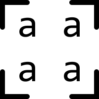
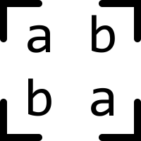
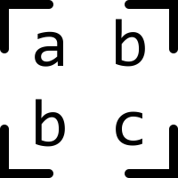
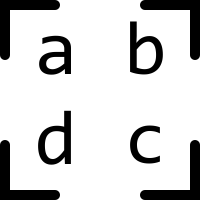

# drawRoundedImage()
This JS code add CanvasRenderingContext2D.drawRoundedImage() method to the Canvas 2D API and provides different ways to draw an image with **rounded corners** onto the canvas.

# Arguments
.drawRoundedImage(image, radius, sx, sy, sWidth, sHeight, dx, dy, dWidth, dHeight)

About arguments *image*, *sx*, *sy*, *sWidth*, *sHeight*, *dx*, *dy*, *dWidth*, *dHeight* you can read at MDN [CanvasRenderingContext2D.drawImage()](https://developer.mozilla.org/en-US/docs/Web/API/CanvasRenderingContext2D/drawImage)

Arggument *radius* can be number or array. Number will set radius of all 4 corners. Array will set each corner spesific in 1-to-4-value syntax (like CSS border-radius). All values in CSS pixels.

## 1-to-4-value syntax

### 1 value array [a] or nubmer a



### 2 value array [a, b]



### 3 value array [a, b, c]



### 4 value array [a, b, c, d]




# How to use
Just like .drawImage():

1. Add code from drawRoundedImage.js to your project
2. Use one of bellow syntax

    2.1. Use the intrinsic size of image
    ```JavaScript
    ctx.drawRoundedImage(image, radius, dx, dy);
    ```
    2.2. Transform size of image 
    ```JavaScript
    ctx.drawRoundedImage(image, radius, dx, dy, dWidth, dHeight);
    ```
    2.3. Transform size of image and crop
    ```JavaScript
    ctx.drawRoundedImage(image, radius, sx, sy, sWidth, sHeight, dx, dy, dWidth, dHeight);
    ```
# Examples

You can try it on [codepen](https://codepen.io/groog/pen/OvPEeo)

```JavaScript
ctx.drawRoundedImage(image, 5, 10, 10);
```

```JavaScript
ctx.drawRoundedImage(image, [15, 5, 0, 5], 25, 25, 100, 100);
```
